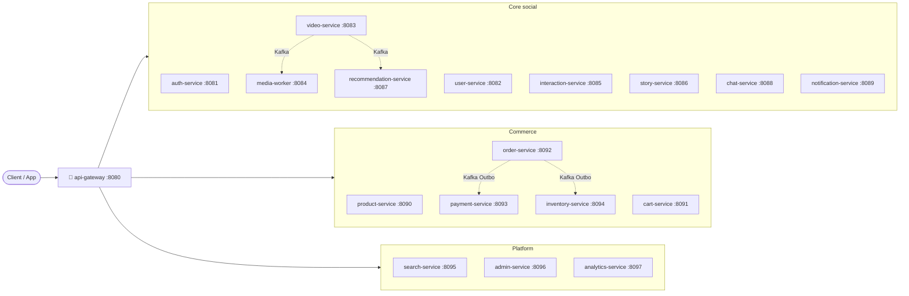

<div align="center">

# 🎬 TikTok Backend

### Microservices Monorepo — Java 21 · Spring Boot 3 · Event-Driven Architecture

[](https://github.com/shoyo2312/EProject-4/actions/workflows/ci-dev.yml)
[](https://github.com/shoyo2312/EProject-4/actions/workflows/ci-master.yml)


18 microservices · 4 shared libraries · Saga, Outbox & Inbox patterns · Soft-delete-first

</div>

---

## 📚 Mục lục

- [Tech Stack](#-tech-stack)
- [Kiến trúc tổng quan](#-kiến-trúc-tổng-quan)
- [Cấu trúc dự án](#-cấu-trúc-dự-án)
- [Bắt đầu nhanh](#-bắt-đầu-nhanh)
- [Database mỗi service](#-database-mỗi-service)
- [Infrastructure URLs (local)](#-infrastructure-urls-local)
- [Windows (PowerShell)](#-windows-powershell)
- [CI/CD](#-cicd)

---

## 🧱 Tech Stack

| Layer     | Technology                          |
|-----------|--------------------------------------|
| ☕ Language  | Java 21 LTS                         |
| 🍃 Framework | Spring Boot 3.3.x                   |
| 📦 Build     | Maven 3.9.x (Maven Wrapper)         |
| 🚪 Gateway   | Spring Cloud Gateway (WebFlux)      |
| 🗄️ Database  | PostgreSQL 16, MongoDB 7, Cassandra |
| ⚡ Cache     | Redis 7                             |
| 📨 Messaging | Kafka 7.6                           |
| 🔍 Search    | Elasticsearch 8                     |
| 🪣 Storage   | MinIO                               |
| 🐳 Container | Docker + Docker Compose             |

## 🗺️ Kiến trúc tổng quan



> Giao tiếp giữa các service: đồng bộ qua HTTP (REST) hoặc bất đồng bộ qua Kafka (Outbox/Inbox pattern) — **không** query trực tiếp DB của service khác.

## 📁 Cấu trúc dự án

```
tiktok-backend/
├── libs/
│   ├── common-lib/          # BaseEntity, DTOs, Exceptions, Utilities
│   ├── event-schema/        # Kafka event classes
│   ├── crypto-lib/          # JWT, Hashing, Encryption
│   └── security-lib/        # Centralized JWT auth config (JwtProperties, JwtAuthenticationFilter, auto-configuration)
├── services/
│   ├── api-gateway/         # :8080 — Spring Cloud Gateway
│   ├── auth-service/        # :8081 — Đăng ký, đăng nhập, JWT
│   ├── user-service/        # :8082 — Profile, Follow/Follower
│   ├── video-service/       # :8083 — Upload, Feed (MongoDB)
│   ├── media-worker/        # :8084 — Transcode, Thumbnail
│   ├── interaction-service/ # :8085 — Like, Comment, Share
│   ├── story-service/       # :8086 — Story 24h (MongoDB)
│   ├── recommendation-service/ # :8087 — For You feed AI
│   ├── chat-service/        # :8088 — Realtime chat (WebSocket)
│   ├── notification-service/ # :8089 — Push, In-app (MongoDB)
│   ├── product-service/     # :8090 — Sản phẩm, Danh mục
│   ├── cart-service/        # :8091 — Giỏ hàng
│   ├── order-service/       # :8092 — Đặt hàng, Saga orchestrator
│   ├── payment-service/     # :8093 — Thanh toán, Ví
│   ├── inventory-service/   # :8094 — Tồn kho
│   ├── search-service/      # :8095 — Elasticsearch wrapper
│   ├── admin-service/       # :8096 — Admin BFF
│   └── analytics-service/   # :8097 — ClickHouse analytics
├── scripts/
├── docs/
├── .gitattributes
├── .gitignore
├── docker-compose.yml
├── Makefile
├── mvnw / mvnw.cmd
└── pom.xml
```

## 🚀 Bắt đầu nhanh

### 1. Yêu cầu

- Java 21 LTS
- Docker Desktop
- IntelliJ IDEA (khuyến cáo)
- Claude CLI

### 2. Khởi động infrastructure

```bash
make infra-up
```

### 3. Build toàn bộ

```bash
./mvnw clean install -DskipTests
# hoặc
make build
```

### 4. Chạy một service

```bash
make run-auth       # auth-service tại :8081
make run-user       # user-service tại :8082
make run-gateway    # api-gateway tại :8080
```

### 5. Xem tất cả lệnh

```bash
make help
```

## 🗄️ Database mỗi service

| Service              | Database                  | Port  |
|----------------------|---------------------------|-------|
| auth-service         | PostgreSQL (auth_db)      | 5432  |
| user-service         | PostgreSQL (user_db)      | 5433  |
| product-service      | PostgreSQL (product_db)   | 5434  |
| cart-service         | PostgreSQL (cart_db)      | 5435  |
| order-service        | PostgreSQL (order_db)     | 5436  |
| payment-service      | PostgreSQL (payment_db)   | 5437  |
| inventory-service    | PostgreSQL (inventory_db) | 5438  |
| admin-service        | PostgreSQL (admin_db)     | 5439  |
| video-service        | MongoDB (video_db)        | 27017 |
| story-service        | MongoDB (story_db)        | 27017 |
| chat-service         | MongoDB (chat_db)         | 27017 |
| notification-service | MongoDB (notification_db) | 27017 |

## 🌐 Infrastructure URLs (local)

| Service       | URL                                                     |
|---------------|---------------------------------------------------------|
| Kafka UI      | http://localhost:9090 (`make infra-tools`)              |
| MinIO Console | http://localhost:9001 (admin: minioadmin/minioadmin123) |
| Elasticsearch | http://localhost:9200                                   |
| Redis         | localhost:6379                                          |

## 🪟 Windows (PowerShell)

```powershell
# Thay ./mvnw bằng mvnw.cmd
mvnw.cmd clean install -DskipTests
mvnw.cmd spring-boot:run -pl services/auth-service
```

## 🔄 CI/CD

Pipeline 2 tầng chạy trên GitHub Actions ([`.github/workflows/`](.github/workflows/)):

| Tầng | Trigger | Nội dung |
|------|---------|----------|
| **Tier 1** — `ci-dev.yml` | PR/push vào `dev` | Build Maven + unit tests + SpotBugs quick scan (fast feedback) |
| **Tier 2** — `ci-master.yml` | PR/push vào `master` | Full test suite (`mvn verify`) + SpotBugs full + OWASP Dependency-Check + SonarQube (nếu có `SONAR_TOKEN`) |

Cả hai nhánh `dev` và `master` đều được bảo vệ bằng branch protection: yêu cầu PR + 1 approval + status check xanh trước khi merge.
